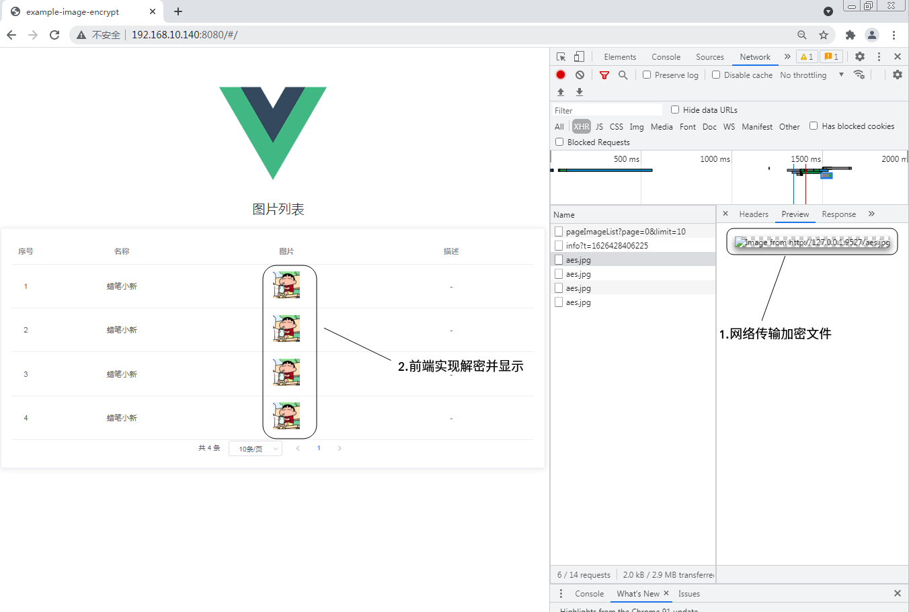
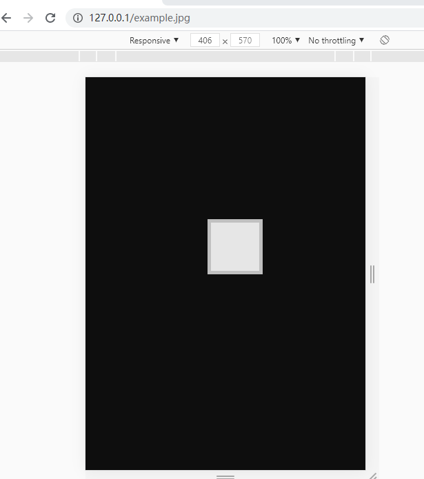
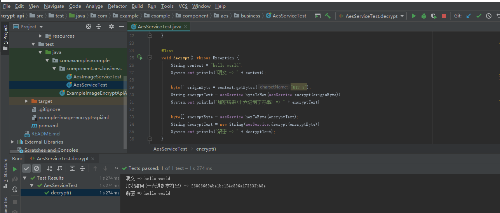
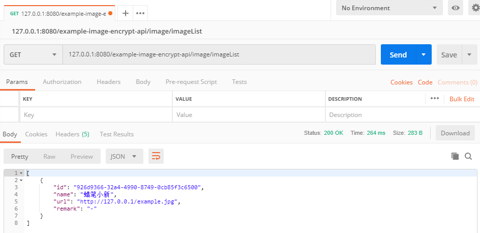
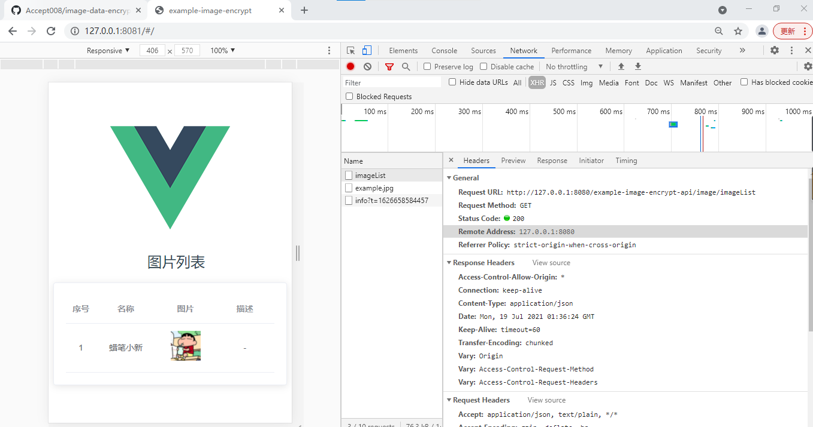
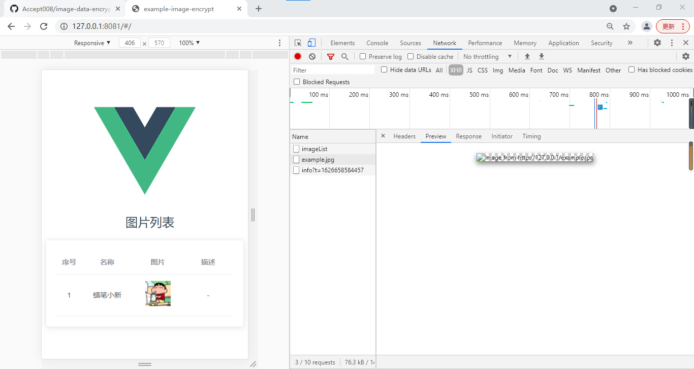

# image-data-encrypt-transmission
图片数据AES CBC模式加密传输.JAVA后端工程进行加密,VUE前端实现解密并显示.

## 说明

- 图片不可直接查看

- 后端AES单元测试

- 后端图片列表接口

- 前端vue调用后端服务

- 前端vue访问图片

*参考文档*

- 1.[前端工程构建](./doc/build-frontend-project.md)
