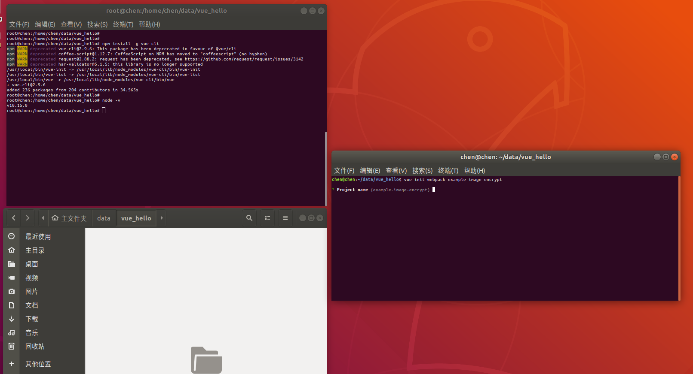
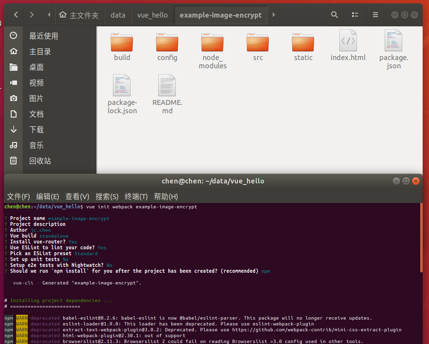
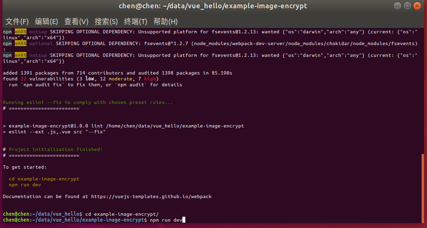
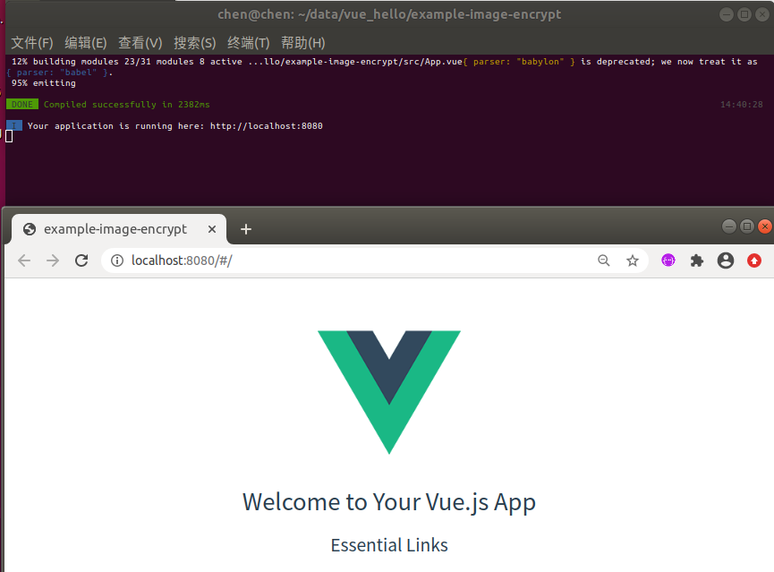
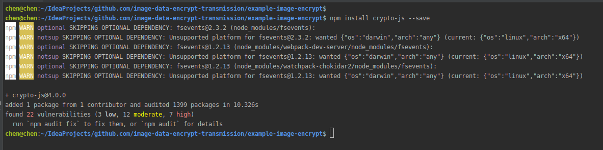

# 构建前端工程

## vue项目初始化
- 安装vue-cli
```yaml
命令: npm install -g vue-cli
注意: 在ubuntu时需切换到root
```


- 初始化前端工程
```yaml
命令: vue init webpack 工程名称
示例: vue init webpack example-image-encrypt
```


- 启动工程
```yaml
命令: npm run dev
```


- 访问前端工程



## 安装加解密JS库(crypto-js)
```yaml
命令: npm install crypto-js --save
```


## 安装axios和element-ui
```yaml
安装axios命令: npm install axios --save-dev
安装element-ui命令:  npm i element-ui -S
```

